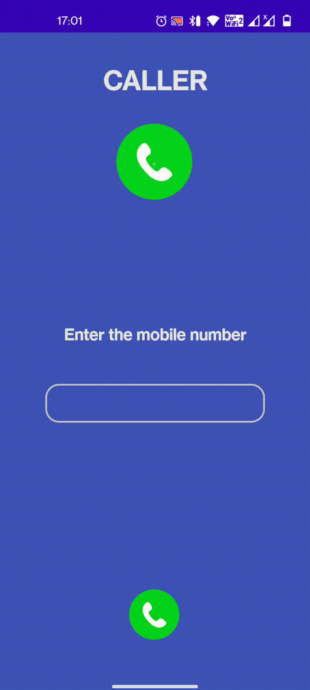

# Phone call demo android studio
Phone call demo in Android studio



[download APK ](app-release.apk)

[download recording ](demo/demo.mp4)

### Code

```

    private void makePhoneCall() {
        String number = mEditTextNumber.getText().toString();

        if (number.trim().length() > 0) {

            if (ContextCompat.checkSelfPermission(MainActivity.this,
                    Manifest.permission.CALL_PHONE) != PackageManager.PERMISSION_GRANTED) {
                ActivityCompat.requestPermissions(MainActivity.this,
                        new String[]{Manifest.permission.CALL_PHONE}, REQUEST_CALL);
            } else {
                String dial = "tel:" + number;
                startActivity(new Intent(Intent.ACTION_CALL, Uri.parse(dial)));
            }

        } else {
            Toast.makeText(MainActivity.this, "Enter Phone Number", Toast.LENGTH_SHORT).show();
        }
    }


```
